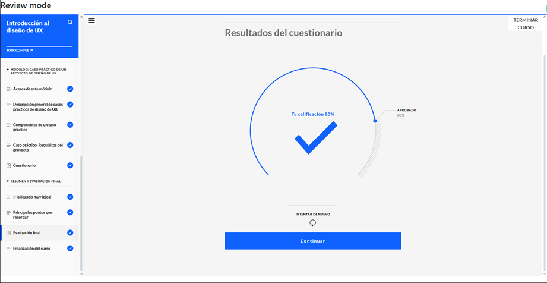
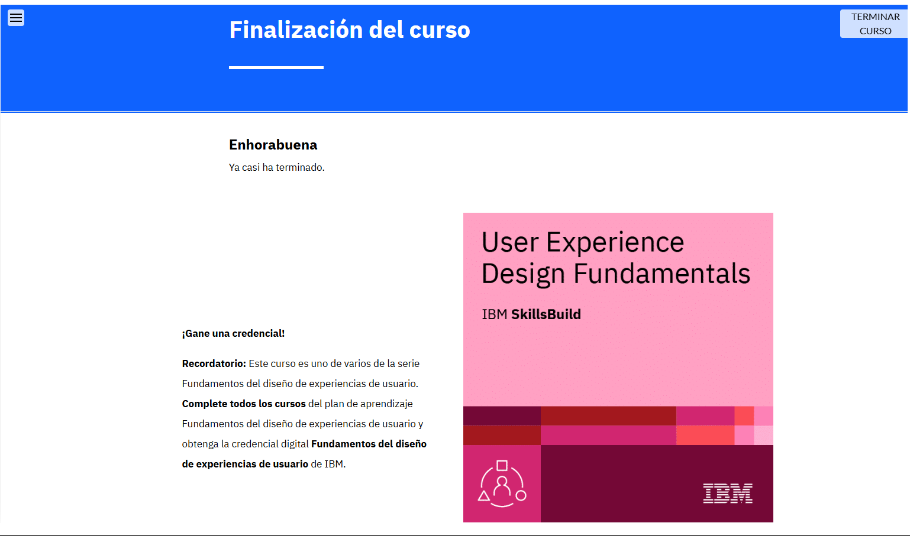

# Introducción al Diseño de UX  

**Constancia de finalización del curso.**

## **Puntos Claves del Curso**  

1. **Fundamentos de UX:** Finalidad, aspectos principales y valor del diseño UX.  
2. **Diferencia entre UI y UX:** Enfoques y aplicaciones en diseño.  
3. **Proceso de Diseño Centrado en el Usuario (UCD):** Pasos clave y aplicación práctica.  
4. **Habilidades del Diseñador UX:** Competencias esenciales para experiencias inclusivas y efectivas.  
5. **Diseño Adaptativo vs. Reactivo:** Características y cuándo utilizar cada uno.  
6. **Casos Prácticos en UX:** Definición, estructura y pasos para su creación.  
7. **Análisis de Casos Prácticos:** Evaluación de ejemplos para extraer requisitos de diseño.  

