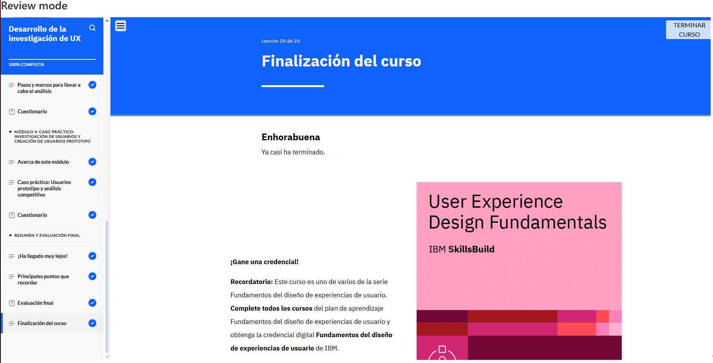

# Desarrollo de la Investigación de UX  

**Constancia de finalización del curso.**

## **Puntos Claves del Curso**  

1. **Investigación en UX:** Importancia y proceso de recopilación de información.  
2. **Casos Prácticos en UX:** Análisis de ejemplos para extraer conclusiones sobre investigación de usuarios.  
3. **Usuarios Prototipo:** Creación y desarrollo basados en datos obtenidos.  
4. **Análisis Competitivo:** Evaluación de la competencia para mejorar el diseño UX.  
