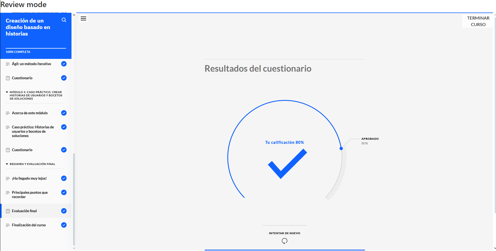
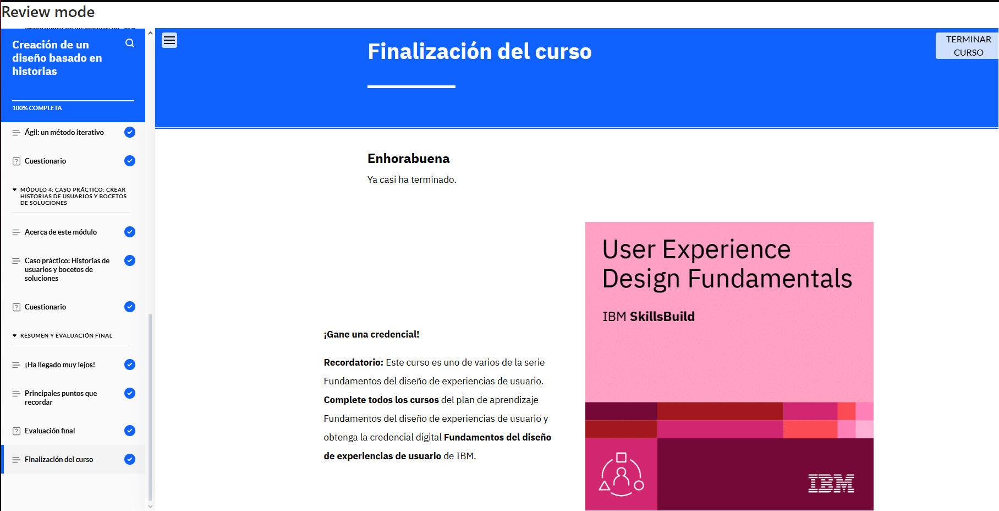

# Creación de un Diseño Basado en Historias  

**Constancia de finalización del curso.**

## **Puntos Claves del Curso**  

1. **Historias de Usuario:** Creación y su impacto en el diseño UX.  
2. **Recorridos de Usuario:** Análisis del comportamiento y necesidades del usuario.  
3. **Flujos de Usuario:** Desarrollo de la secuencia de interacción en el diseño.  
4. **Bocetos de Soluciones:** Generación de ideas visuales para la experiencia del usuario.  
