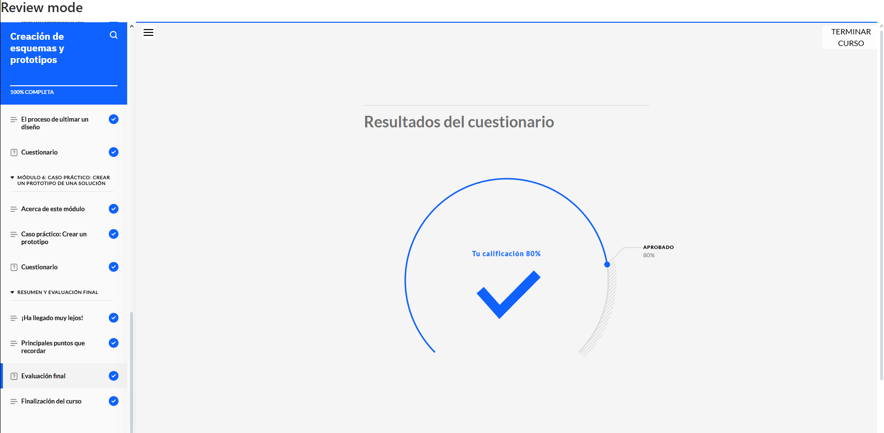

# Creación de Esquemas y Prototipos  

**Constancia de finalización del curso.**

## **Puntos Claves del Curso**  

1. **Escritura de Experiencias de Usuario (UX):** Buenas prácticas para una comunicación efectiva.  
2. **Arquitectura de la Información (IA):** Definición, finalidad y su rol en el diseño UX.  
3. **Mapas de Sitio:** Concepto, utilidad y pasos para su creación.  
4. **Esquemas (Wireframes):** Tipos, finalidad y su aplicación en UX.  
5. **Análisis de Casos Prácticos:** Creación de IA, mapas de sitio y esquemas en UX.  
6. **Diseño de Interfaz de Usuario (UI):** Principios fundamentales y mejores prácticas.  
7. **Accesibilidad en Productos Digitales:** Objetivos y estrategias para garantizar inclusión.  
8. **Creación de Prototipos:** Técnicas y su importancia en el proceso de diseño.  
9. **Evaluación de Casos Prácticos:** Desarrollo de UI y prototipos basados en ejemplos reales.  
