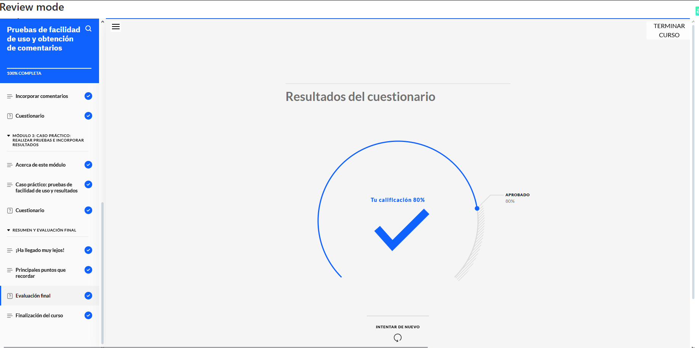
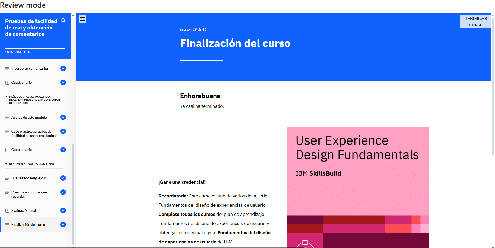

# Pruebas de Facilidad de Uso y Obtención de Comentarios  

**Constancia de finalización del curso.**

## **Puntos Claves del Curso**  

1. **Pruebas de Facilidad de Uso:** Definición, objetivos y su importancia en UX.  
2. **Elementos Claves de una Prueba de Usabilidad:** Factores esenciales para evaluar la experiencia del usuario.  
3. **Enfoques Cualitativo y Cuantitativo:** Diferencias y aplicaciones en las pruebas de usabilidad.  
4. **Métodos de Pruebas de Usabilidad:** Técnicas para realizar pruebas cualitativas y cuantitativas.  
5. **Proceso de Pruebas de Usabilidad:** Pasos fundamentales para una evaluación efectiva.  
6. **Evaluación Heurística:** Concepto y aplicación en la mejora del diseño UX.  
7. **Herramientas para Pruebas de Usabilidad:** Tecnologías y software utilizados por diseñadores UX.  
