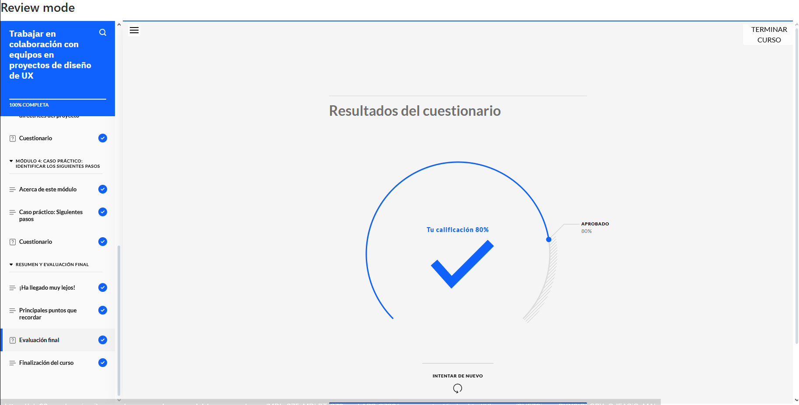
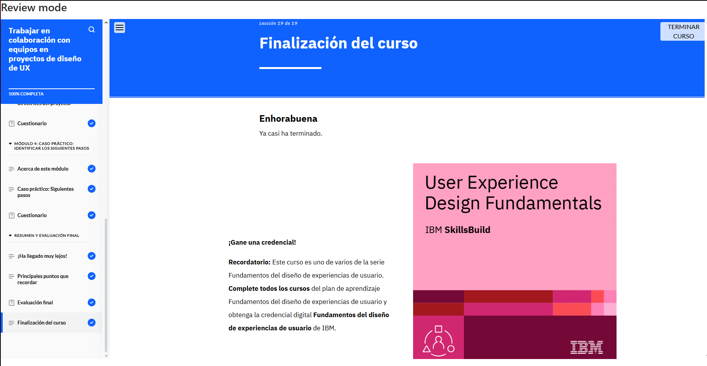

# Trabajar en Colaboración con Equipos en Proyectos de Diseño de UX  

**Constancia de finalización del curso.**

## **Puntos Claves del Curso**  

1. **Equipos Multidisciplinarios:** Definición y ventajas en proyectos de UX.  
2. **Roles en un Proyecto de UX:** Identificación de responsabilidades dentro del equipo.  
3. **Buenas Prácticas de Colaboración:** Estrategias para una comunicación y trabajo en equipo efectivos.  
4. **Rol del Desarrollador en UX:** Participación en las fases clave del diseño de UX.  
5. **Comunicación entre Diseño y Desarrollo:** Importancia de la sincronización entre ambos equipos.  
6. **Elementos de Diseño para Desarrollo:** Qué información debe ser traspasada al equipo técnico.  
7. **Revisión y Pruebas de Productos Digitales:** Criterios para validar el producto final.  
8. **Normas y Directrices del Proyecto:** Documentación y estandarización en UX.  
9. **Gestión de Archivos y Versiones:** Buenas prácticas para organizar y administrar proyectos.  
10. **Análisis de Casos Prácticos:** Evaluación de la colaboración en proyectos de UX, incluyendo roles, flujos de trabajo y revisión del producto final.  
