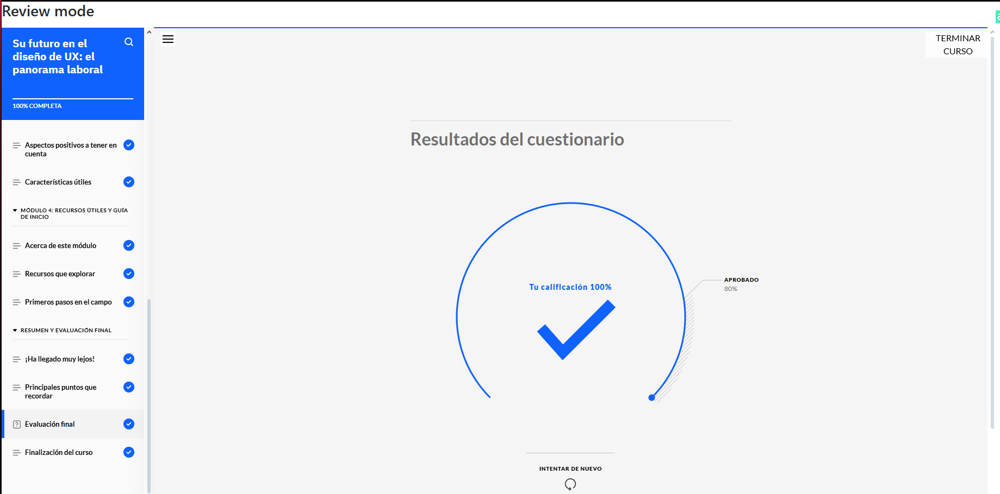
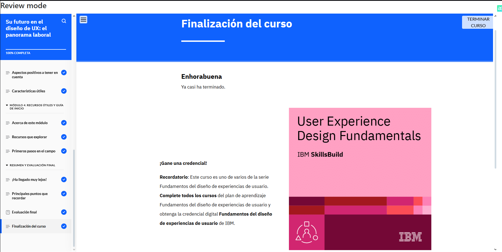

# Su Futuro en el Diseño de UX: El Panorama Laboral  

**Constancia de finalización del curso.**

## **Puntos Claves del Curso**  

1. **Sectores para Diseñadores de UX:** Ámbitos donde se aplica el diseño UX.  
2. **Demanda Global de UX:** Panorama actual del mercado laboral.  
3. **Futuro del Diseño de UX:** Tendencias y evolución del campo.  
4. **Roles Comunes en UX:** Posiciones clave dentro de la industria.  
5. **Responsabilidades del Diseñador de UX:** Principales tareas y funciones.  
6. **Competencias Clave en UX:** Habilidades necesarias para destacar en el campo.  
7. **Recursos de Aprendizaje:** Fuentes para seguir mejorando y mantenerse actualizado.  
