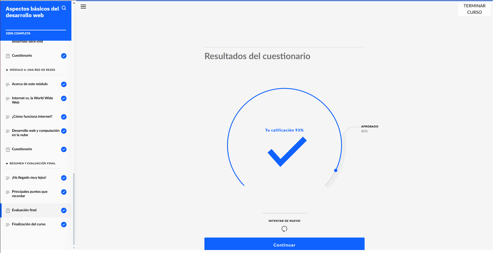
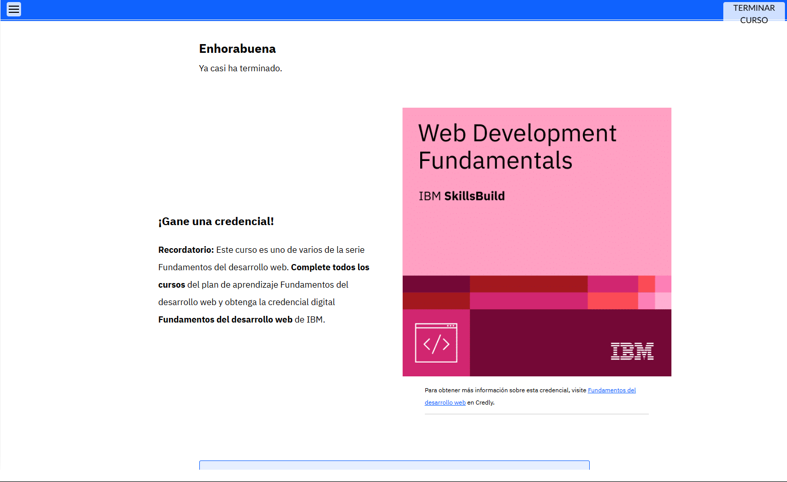

## ASPECTOS BASICOS DEL DESARROLLO WEB 

*Comprobante de realizacion primer modulo* 

## En este Curso hemos aprendido lo basico del desarrollo web como por ejemplo temas a tener en cuenta, lenguajes de compilado, hojas de estilo, tipos de entrada, salida, hardware, software etc. 

* Tener en cuenta que aunque sea extenso por sus cuestionarios, aprendemos bastante y repasamos temas que ya hemos visto en otros cursos 