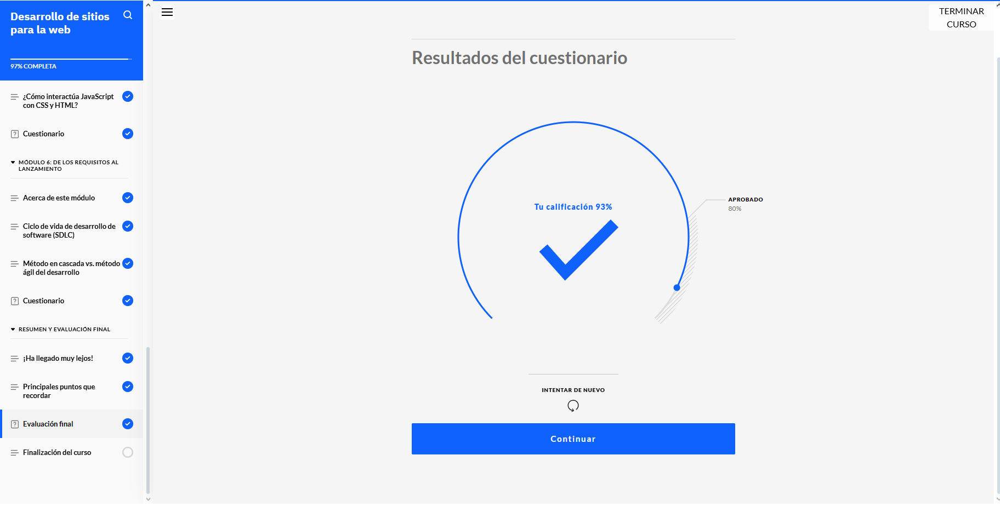
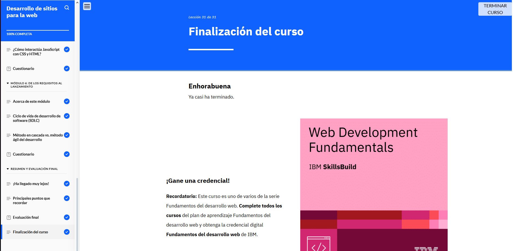

## ASPECTOS BASICOS DEL DESARROLLO WEB

*Comprobante del modulo 2 aspectos basicos del desarrollo web*

## En el modulo 2 aprendemos sobre el etiquetado, lenguaje como javascript que funciona para enviar una alerta y/o hacerlo responsive, todo lo relacionado al desarrollo de sitios  para web. 

* Este modulo da un paso cercano a la introducción si es que no lo es, de HTML Y CSS y parte de la logica conocida como javascript. 