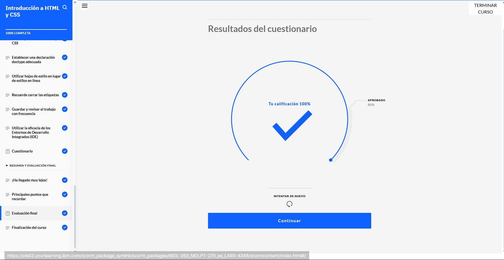
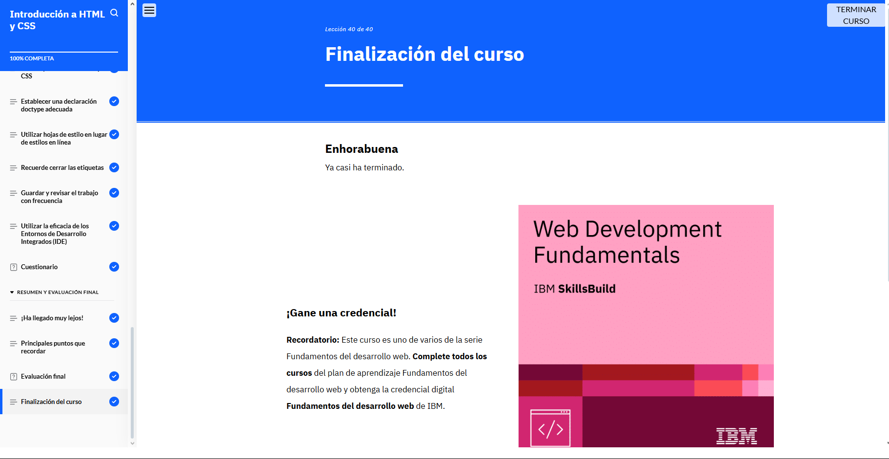

## ASPECTOS BASICOS DEL DESARROLLO WEB 

*Comprobante de realización tercer modulo*

## En este Modulo 3, aprendimos a como identificar los problemas de los personas como por ejemplo dar un estilo, añadir un link externo de hoja de estilo etc. 

**Tenmos en cuenta que en este modulo el html y css se hace más presente que los anteriores dos y se logra aprender y diferenciar muchas cosas que hemos realizado, estuvo excelente.**