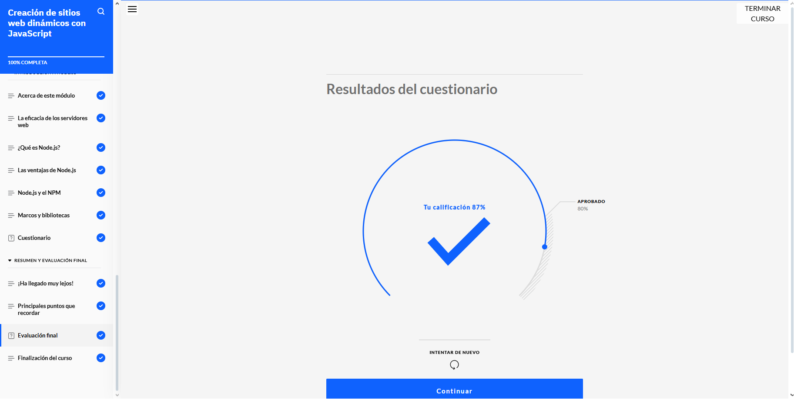
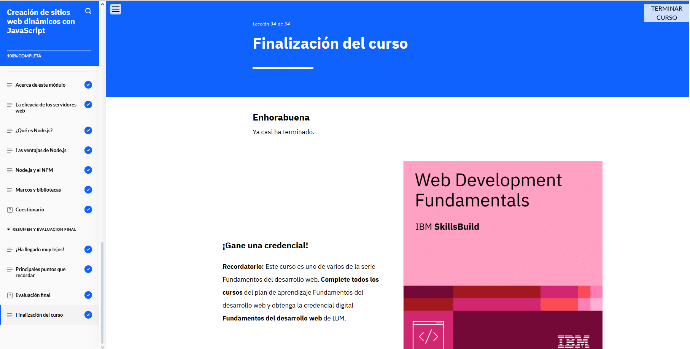

## ASPECTOS BASICOS DEL DESARROLLO WEB

*Comprobante validacion del modulo*

### Resumen de lo aprendido

JavaScript es un lenguaje de programación versátil utilizado tanto en el desarrollo web front-end como back-end. Permite crear sitios web dinámicos y responder a eventos iniciados por los usuarios. Combina características de programación funcional y orientada a objetos, lo que facilita la reutilización de código, la herencia y la encapsulación.

En JavaScript, las variables pueden contener cualquier tipo de datos, y el lenguaje determina su tipo durante la ejecución. Los tipos de datos incluyen booleanos, números, cadenas, indefinidos y null. Además, las bases de datos son fundamentales en el desarrollo, almacenando información en tablas y permitiendo operaciones CRUD (crear, leer, actualizar y eliminar) mediante SQL.

Por último, herramientas como Node.js y NPM amplían las capacidades de JavaScript, permitiendo construir servidores web eficientes y utilizar bibliotecas de código abierto para optimizar el desarrollo.
