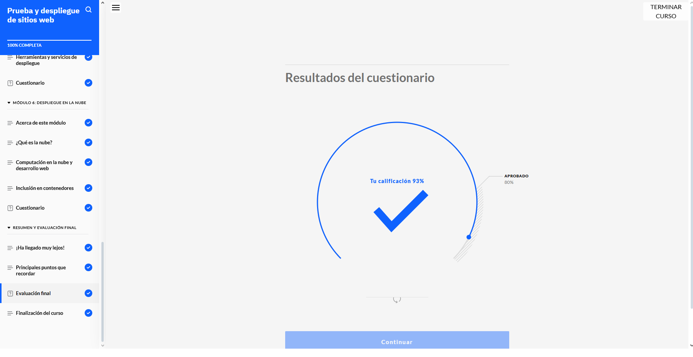
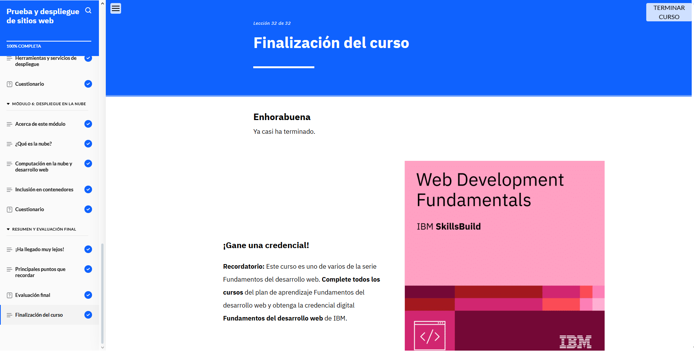

## ASPECTOS BASICOS DEL DESARROLLO WEB

*Prueba validacion del modulo 5*
    

### Reflexión sobre el Módulo 5

En este módulo aprendimos la importancia de probar los sitios web para garantizar una experiencia de usuario y un software de calidad. Descubrimos que existen diversos tipos de pruebas, como la aceptación, la integración, el rendimiento y la usabilidad, cada una con objetivos específicos.

También entendimos que al probar un sitio web, es crucial considerar aspectos como la interfaz de usuario, el diseño reactivo, el código, las API y las bases de datos. Además, exploramos cómo el control de versiones es una herramienta esencial para gestionar y rastrear los cambios en el código, y cómo los sistemas de control de versiones ofrecen funcionalidades como repositorios de código y herramientas de colaboración.

Aprendimos sobre los métodos de entrega continua y despliegue continuo, que permiten a los desarrolladores implementar actualizaciones y nuevas compilaciones de manera eficiente. Asimismo, conocimos el enfoque DevOps, que fomenta la colaboración entre los equipos de desarrollo, operaciones y la empresa, y cómo su ciclo de vida ayuda a publicar sitios web de alta calidad más rápidamente.

Por otro lado, comprendimos cómo los navegadores web utilizan el protocolo HTTP para comunicarse con los servidores y cargar páginas web. También reflexionamos sobre la importancia del diseño reactivo, que adapta el sitio web al dispositivo del usuario, y cómo los marcos de trabajo facilitan este proceso al proporcionar bibliotecas de código y herramientas para gestionar datos e interfaces.

Finalmente, exploramos cómo los desarrolladores pueden entregar sitios web como aplicaciones descargables mediante wrappers de aplicaciones, y cómo la automatización del despliegue, las herramientas basadas en la nube y los contenedores de software han revolucionado el desarrollo web, ofreciendo soluciones escalables, seguras y eficientes.

Este módulo nos dejó una visión más clara y práctica de los fundamentos del desarrollo web y las herramientas modernas que lo hacen posible.
