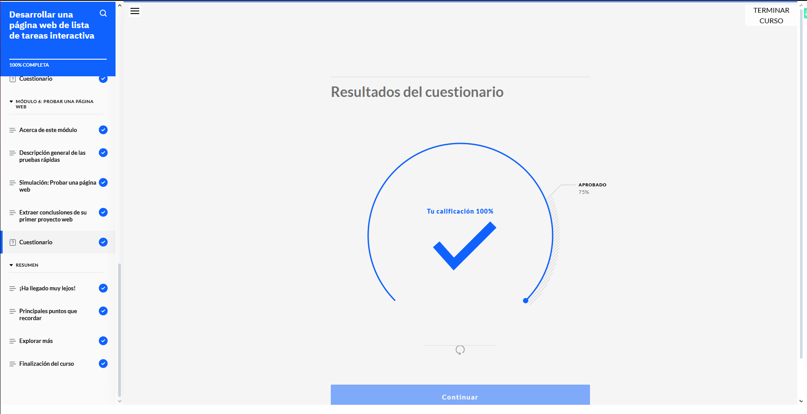
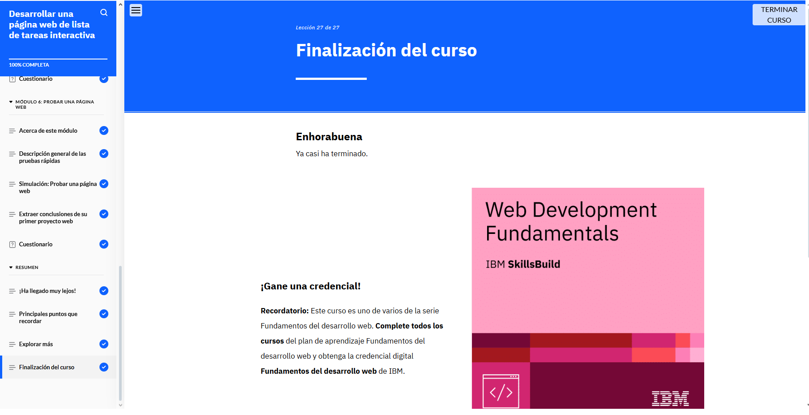

## ASPECTOS BASICOS DEL DESARROLLO WEB

*Validacion del modulo*

### Resumen de lo aprendido

El desarrollo web combina conocimientos de codificación, diseño y pruebas para crear soluciones funcionales y atractivas. En este caso, el objetivo principal fue desarrollar una página web interactiva que permita a los empleados gestionar sus tareas mediante una lista dinámica.

Durante el proceso, se revisaron los requisitos del gestor de producto y los wireframes del diseñador web para definir el desarrollo. Además, se realizaron prácticas que incluyeron:

- Configurar un proyecto en VS Code con archivos HTML, CSS y JavaScript.
- Escribir HTML para estructurar la página web.
- Aplicar estilos con CSS para mejorar su diseño visual.
- Implementar interactividad con JavaScript.
- Probar la página para asegurar su correcto funcionamiento.

Estas actividades permitieron consolidar habilidades clave en el desarrollo web.